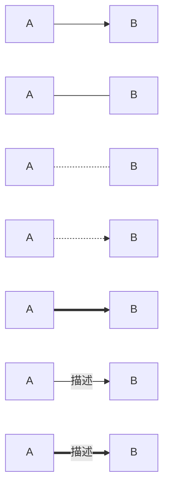
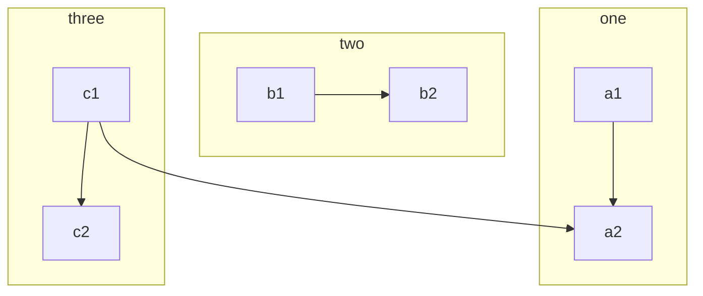
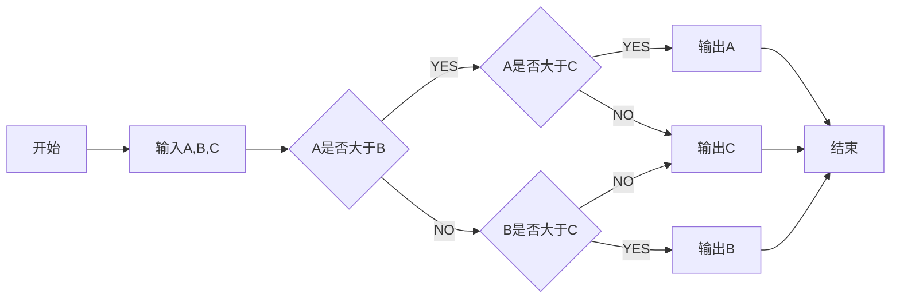
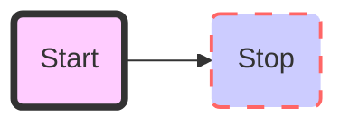

## 0x0 基本用法 ##

每一个元素块之间都需要有一行分d

- `# ## ###`分别表示第一级标题，第二级，第三级标题，一般一个md中只放一个一级标题
- 规范的标题中标题首尾都需要有`#` 使用tab键可以对标题进行折叠和展开
- 建议使用如 0x00 格式的内容包含在标题上，使得标题更为有层次
- 在文字换行后使用`===`可以变成一级标题，使用`---`可以为二级标题
- 建议在标题后使用`>`对标题的内容做基本的介绍

### 0x02 序列 ###
- `-` `*` `+` 常用于无序列的标记 (其后带空格)
- `1.` 等常用于有序列的标记  (数字加点)
- 上一级和下一级之间敲四个空格即可以列表嵌套
    - 二级
    - 二级
- 如果在列表中加入了区块引用，区域引用标记符需要缩进4个空格

    如果在单一列表项中包含了多个段落，为了保证渲染正常，`*`与段落首字母之间也必须保留四个空格

### 0x03 块 ###
- ` ` ` 用于标记特定的内容
- ```` `用于编辑一块代码区域，可以在其后添加如python，java等的指定语言的信息, 需要空一格
- `>` 用于引用块的标记
- `---`可以作为块区域之间的划分线 (三个或者三个以上的 - 或者 * 都可以，行内不能有其他东西)
---
### 0x04字体 ###
- `*` 用于*斜体* 、 **加粗**、***斜体加粗***
- `_` 用于_斜体_ 、 __加粗__、___斜体加粗___
- `~~` 用于 ~~加删除线~~
### 0x05链接 ###
- [超链接名](超链接地)  
-  本地图片建议使用相对地址来寻找，可以在当前文件夹下新建`pic`文件夹放图片
- 可以使用索引的方式添加链接信息[]中的信息相互对应
- I get 10 times more traffic from [Google][1] than from
[Yahoo][] or [MSN][].
[1]: http://google.com/        "Google"
[yahoo]:  http://search.yahoo.com/  "Yahoo Search"
[msn]:    http://search.msn.com/    "MSN Search"
### 0x06表格 ###

表头|表头|表头
---|:--:|---:
内容|内容|内容
内容|内容|内容
- 三个短斜杠左右的冒号用于控制对齐方式，只放置左边冒号表示文字居左，只放置右边冒号表示文字居右，如果两边都放置冒号表示文字居中。


## 0x1 高级用法

### 0x11 内嵌HTML ###

- 在 HTML 区块标签间的 Markdown 格式语法将不会被处理。

-   <div style="page-break-after: always;">强制换页，用于转换PDF时的分页</div>  

- 字体设计

<font color='#ff0000'>huhuhu</font>

- [颜色参考](http://www.w3school.com.cn/tags/html_ref_colornames.asp)

- 表格

<table>
    <tr>
        <td>Foo</td>
    </tr>
</table>

+ 内嵌网页

<iframe height='265' scrolling='no' title='Fancy Animated SVG Menu' src='//codepen.io/jeangontijo/embed/OxVywj/?height=265&theme-id=0&default-tab=css,result&embed-version=2' frameborder='no' allowtransparency='true' allowfullscreen='true' style='width: 100%;'>See the Pen <a href='#'>Fancy Animated SVG Menu</a> by Jean Gontijo (<a href='https://codepen.io/jeangontijo'>@jeangontijo</a>) on <a href='https://codepen.io'>CodePen</a>. 
</iframe>  

<blockquote class="twitter-tweet"><p lang="en" dir="ltr">Sunsets don&#39;t get much better than this one over <a href="#">@GrandTetonNPS</a>. <a href="#">#nature</a> <a href="#">#sunset</a> <a href="#“>d</a></p>&mdash; US Department of the Interior (@Interior) <a href="#">May 5, 2014</a></blockquote> <script async src="#" charset="utf-8"></script>  
+ 内嵌音频，视频(直接加入html代码)

	<audio src="xxx.mp3" />  
<video src="xxx.mp4" />
### 0x12 字符公式 ###

- 数学公式使用时需要使用$包起来，$和$$切换使用，但是以此转化为的doc文件可能效果不理想

  - $$
    \textbf{加粗内容} 、 \text{空格：}\quad 也可以用斜杠 \ \pmb{\theta}_i
    $$

  - 常见希腊字符(一般小写首字母大写可以得到相应大写希腊字符)
    $$
    \alpha — \beta - \gamma - \delta - \tau - \eta - \theta - \mu - \phi -\Phi - \Gamma - \infty
    $$

  - 常用运算符，简单分式建议使用`/`
    $$
    \sqrt n - \frac{a}{b} - \int_a^b - \sum_{a}^{b} - \sum\limits_{a}^{b} - \prod_{ab} - f'(x)\\
    C^k_n = {n \choose k} \\
  lim_{x \to \infty}多行
    $$
    
  - 多行
    $$
    括号公式：
    \begin{cases}
    x=2\\
    x-3
    \end{cases}\\
    多行公式:
    \begin{gather}
    a \\
    d
    \end{gather} \\
    矩阵
    \begin{array}{cc}
    x & x+1\\
    y & y+1
    \end{array}
    $$
  
- 向量
    $$
    \overrightarrow{a}=\overrightarrow{AB}=\vec{a}
    $$
  
- 关系符
    $$
    < > = \le \leq \ge \geq \\ \equiv \sim  \approx {\mid} \parallel \notin \overline{x} x' \propto \\
    \bigcup    \overline{x}  \underline{x} \overbrace{x+y} \ \hat{a}  \dot{a} \bar{a}\\
    \nabla \ \mathrm{dx}
    $$
  
  - 省略号
  $$
    \dots
  $$
  
- 矩阵
  $$
    \$$
  	\begin{matrix}
    	1 & x & x^2\\
    	1 & y & y^2\\
    	1 & z & z^2\\
    	\end{matrix}
    \$$
  $$
  
  - 行列式
  $$
    X=\left|
    	\begin{matrix}
    		x_{11} & x_{12} & \cdots & x_{1d}\\
    		x_{21} & x_{22} & \cdots & x_{2d}\\
    		\vdots & \vdots & \ddots & \vdots \\
    		x_{11} & x_{12} & \cdots & x_{1d}\\
    	\end{matrix}
    \right|
  $$
  - 分段函数
  $$
  f(n)=
    \begin{cases}
    n/2, & \text{if $n$ is even}\\
    3n+1,& \text{if $n$ is odd}
    \end{cases}
  $$
  - $$
    \frac{\partial J(\theta)}{\partial\theta_j} = -\frac1m\sum_{i=0}^m(y^i - 	h_\theta(x^i))x^i_j
  $$
- $$
    J(\theta) = \frac{1}{2m}\sum_{i=0}^m(y^i - h_\theta(x^i))^2
  $$
  
  - $$
    H_c=\sum_{l_1+\dots +l_p}\prod^p_{i=1} \binom{n_i}{l_i}
    $$
  
- 推导过程
    $$
    \begin{align}
    	\frac{\partial J(\theta)}{\partial\theta_j}
    	& = -\frac1m\sum_{i=0}^m(y^i - h_\theta(x^i)) \frac{\partial}{\partial\theta_j}(y^i-h_\theta(x^i))\\
    	& = -\frac1m\sum_{i=0}^m(y^i-h_\theta(x^i)) \frac{\partial}{\partial\theta_j}(\sum_{j=0}^n\theta_j x^i_j-y^i)\\
    	&=-\frac1m\sum_{i=0}^m(y^i -h_\theta(x^i)) x^i_j
    \end{align}
   $$
  
- &lambda; &mu; &phi; [reference](http://www.w3school.com.cn/tags/html_ref_symbols.html)

- &copy;  &reg; &times;

- 如 \>  等在 markdown 中含有标签作用的字符需要使用`\`来转义，或者使用HTML的实体符号

### 0x13 流程图

#### mermaid 

- TB 从上到下
- BT 从下到上
- RL 从右到左
- LR 从左到右
- TD 同TB
- id + [文字描述]矩形
- id + (文字描述)圆角矩形
- id + >文字描述]不对称的矩形
- id + {文字描述}菱形
- id + ((文字描述))圆形



子流程图



综合使用



自定义样式



### 0x14 目录

`[TOC]`可以自动生成文档目录


### 0x15 TODO list 

- [ ] This task is incomplete.
- [x] This task is completed.

## 0x2 文档模板

### 0x20 开发模板

```markdown
[TOC]
## 基础
> 路径

##相关接口
### 接口功能
 
| 方法 | 路径 |功能|开发者|时间
|------|------|-----|
|post| /server |添加服务器密码|李星帅|2018-8-8
 
### 参数说明
 
| 参数 |参数名 |注释|
|------|------|
|ip  | ip  | 服务器的管理网IP |

### 支持格式
> JSON

### 返回字段

### 调用例子
测试环境路径：http://xxx.xxxx.com/rest/v1/serverPwd/add
参数：
​```json
{
    ip:"192.168.66.1"
}
​```
返回结果：
​```json
{
    "code": 0,
    "info": "[rest] 添加设备密码成功"
}
​```
```


